# Knoughts and Crosses
(Developer: David Gray)

![Home Screen]

## Table of Contents

1.  [Project Goals](#project-goals)
    1.  [User Goals](#user-goals)
    2.  [Site Owner Goals](#site-owner-goals)
2.  [User Experience](#user-experience)
    1.  [Target Audience](#target-audience)
    2.  [User requirements and Expectations](#user-requirements-and-expectations)
    3.  [User Stories](#user-stories)
    4.  [Site Owner Stories](#site-owner-stories)
3.  [Design](#design)
    1.  [Flowchart](#flowchart)
4.  [Technologies Used](#technologies-used)
    1.  [Languages](#languages)
    2.  [Frameworks and Tools](#frameworks-and-tools)
5.  [Features](#features)
6.  [Validation](#validation)
    1.  [PEP8](#pep8)
    2.  [Test User Stories](#test-user-stories)
7.  [Bugs](#bugs)
8.  [Deployment](#deployment)
9.  [Future Considerations](future-considerations)
10. [Credits](credits)
11. [Acknowledgments](#acknowledgments)

## Project Goals
Knoughts and Crosses is an app of the classic that the user can play in the terminal.

### User Goals
- Enjoy a game of Knoughts and Crosses

### Site Owner Goals
- Offer a simple and easy to use game to players who want some relaxing fun

## User Experience

### Target Audience
- Knoughts and Crosses Enthusiasts
- Children who want to learn the game

### User Requirements and Expectations
- That the game is easy to use
- That the game is easy to understand
- That the game is easy to read on the terminal

### User Stories
1. As a user, I want to be able to see what numbers correspond to which square
2. As a user, I want to be able to choose which square my letter goes into
3. As a user, i want to see my selection appear on the game board
4. As a user, I want to have an opponent
5. As a user, I want to see who's turn it is next
6. As a user, I want to see the winner

### Site Owner Stories
7. As a site owner, I want the user to select whichever square they want
8. As a site owner, I want the user to get feedback on who won the game
9. As a site owner, I was the user to have fun!

## Design

### Flowchart

Flowchart

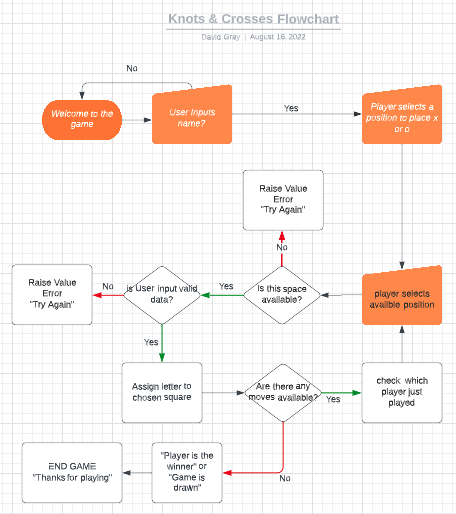

## Technologies Used

### Languages
- Python 3

### Frameworks and Tools
- GitHub
- GitPod
- Git
- Lucid Charts - to create Flowchart

## Features

### Welcome Message
- The welcome message is printed welcome message and ASCII art of a Knoughts and Crossed board

Welcome Message

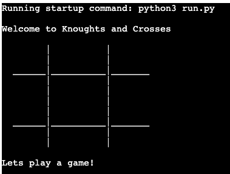

### Game Board
- Shows the user the game board and which numbers apply to which square
- User stories 1, 3, 7

Game Board

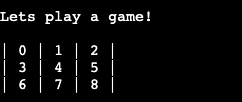

### User Input
- Input line for the user to make their selection
- User stories 2, 5, 7

User Input

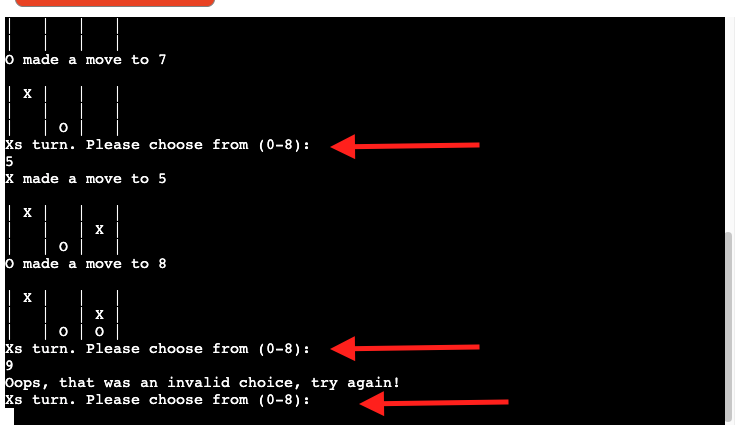

### Game Progressing
- Each players selection should progressively populate the board
- User story 3, 4

Game Progressing

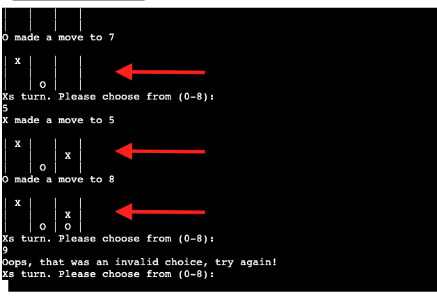

### Alternating Players
- There has to be an opponent to play against and no player can play more than one shot at a time
- User story 4, 5

Alternating Players

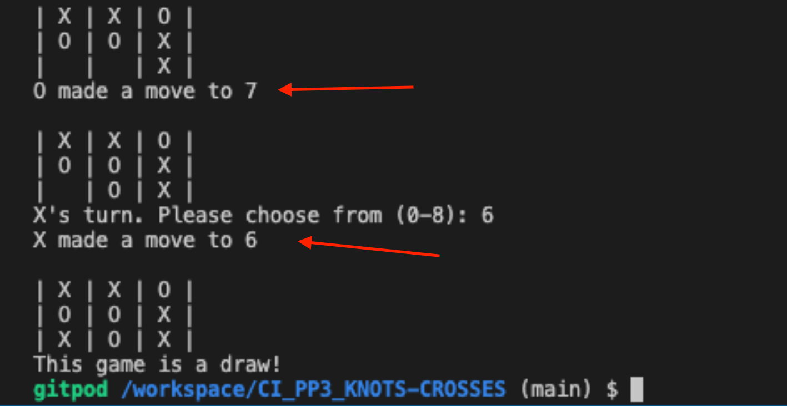

### Feedback error
- The user is to be alerted if they make an invalid choice of input

Feedback Error

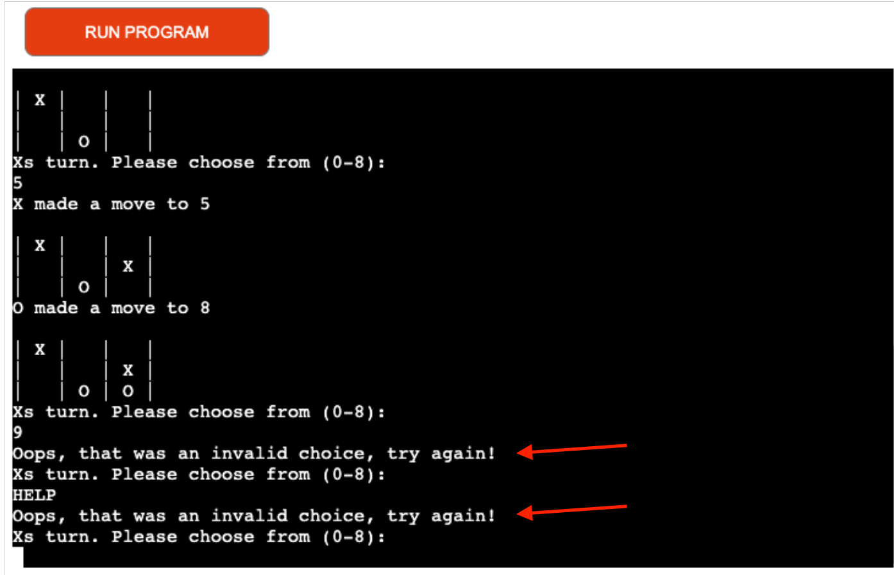

### Winner
- The user should be alerted if there is a winner
- User story 6, 7

Winner

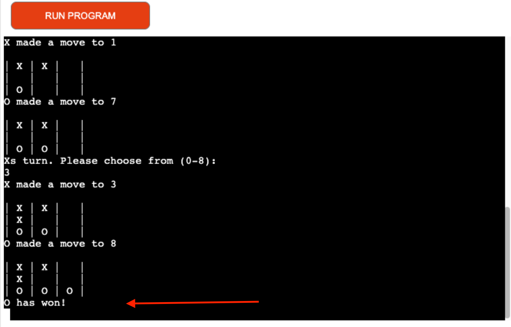

## Validation

### PEP8 Validation
PEP8 online was used to check the code for warnings and errors for the code.
All the code pases with no errors and no warnings.

run.py

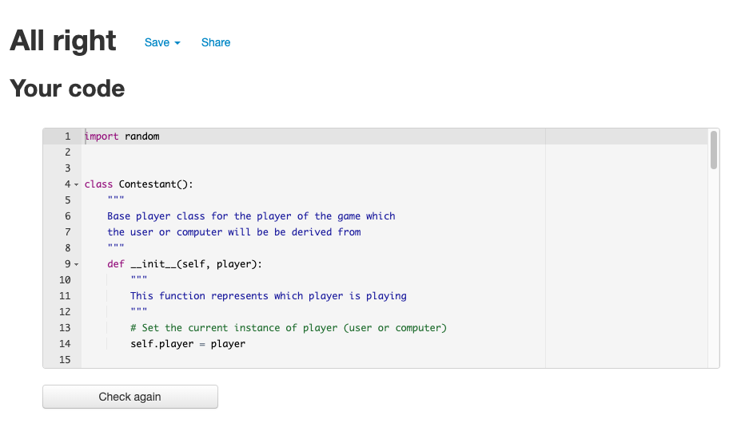

players.py

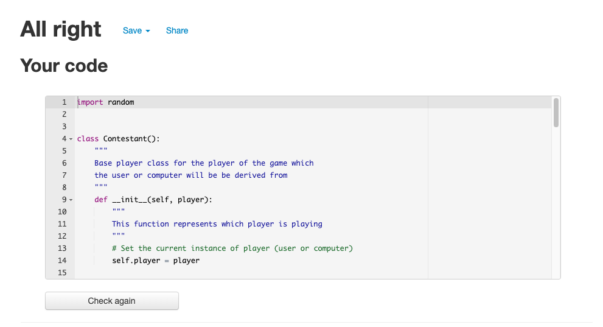

### Testing User Stories

1. As a user, I want to be able to see what numbers correspond to which square

| **Feature** | **Action** | **Expected Result** | **Actual Result** |
|-------------|------------|---------------------|-------------------|
| Board populates | Run Program | The board should pop up and show which numbers will populate to which square of the board | Works as expected |

Snapshot

2. As a user, I want to be able to choose which square my letter goes into

| **Feature** | **Action** | **Expected Result** | **Actual Result** |
|-------------|------------|---------------------|-------------------|
| User chooses place | Input an integer between 0-8 | a 'x' or 'o' will appear on the board | Works as expected |

Snapshot

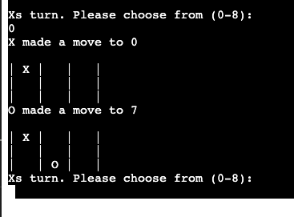

3. As a user, i want to see my selection appear on the game board

| **Feature** | **Action** | **Expected Result** | **Actual Result** |
|-------------|------------|---------------------|-------------------|
| Board populating | players alternating shots | Board populates with players selections until the game is over | Works as expected |

Snapshot

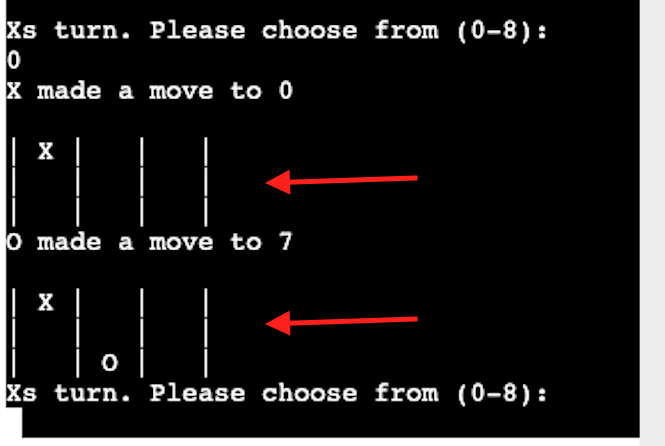

4. As a user, I want to have an opponent

| **Feature** | **Action** | **Expected Result** | **Actual Result** |
|-------------|------------|---------------------|-------------------|
| Computer player | User makes a move | The computer should respond with it's own move | Works as expected |

Snapshot

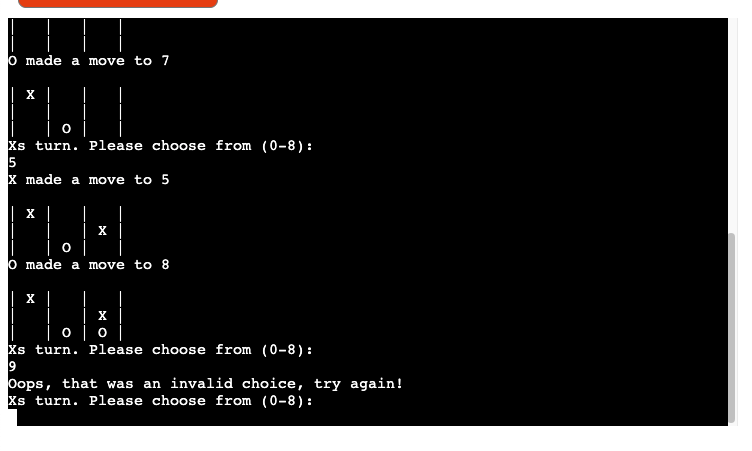

5. As a user, I want to see who's turn it is next

| **Feature** | **Action** | **Expected Result** | **Actual Result** |
|-------------|------------|---------------------|-------------------|
| Alternating players | One of the players makes a selection | The next player should pop up on the command line to tell them its their shot | Works as expected |

Snapshot

6. As a user, I want to see the winner

| **Feature** | **Action** | **Expected Result** | **Actual Result** |
|-------------|------------|---------------------|-------------------|
| Game winner | Play the game to the end | Either one of the users wins or the game is drawn | Works as expected |

Snapshot

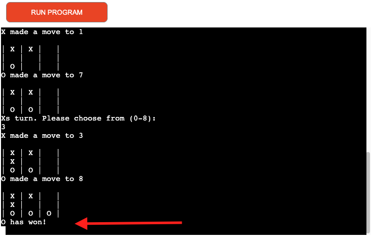

7. As a site owner, I want the user to select whichever square they want

| **Feature** | **Action** | **Expected Result** | **Actual Result** |
|-------------|------------|---------------------|-------------------|
| Game board + User input | Player chooses a square | The chosen square should be populated with the players letter i.e "x" or "o" | Works as expected |

Snapshot

8. As a site owner, I want the user to get feedback on who won the game

| **Feature** | **Action** | **Expected Result** | **Actual Result** |
|-------------|------------|---------------------|-------------------|
| Game winner | The players play the game to the end | Either one of the players wins or the game is drawn | Works as expected |

Snapshot

9. As a site owner, I was the user to have fun!

| **Feature** | **Action** | **Expected Result** | **Actual Result** |
|-------------|------------|---------------------|-------------------|
| Enjoyment | Play the game | User has fun | Hopefully the user had lots of fun playing the game :) |
